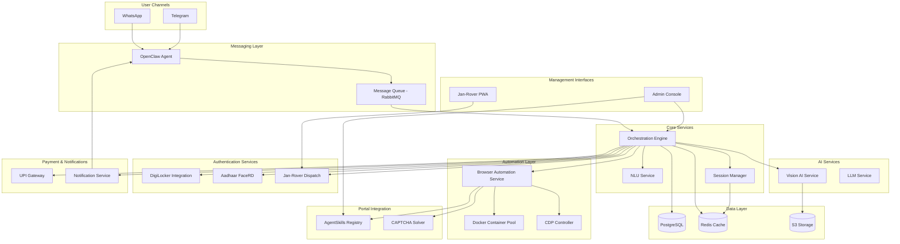

# Design Document: CSA (Common Services Agent)

## Overview

The Common Services Agent (CSA) is a distributed, microservices-based system that provides autonomous AI-powered access to Indian government e-governance services through WhatsApp and Telegram. The system architecture is designed for high scalability, security, and reliability, handling potentially millions of concurrent users across diverse network conditions.

### Key Design Principles

1. **Autonomous Operation**: Minimize human intervention through intelligent automation
2. **Fault Tolerance**: Graceful degradation with multiple fallback mechanisms
3. **Security First**: End-to-end encryption, isolated sessions, and compliance with Indian data protection regulations
4. **Scalability**: Horizontal scaling for all components to handle 500M+ potential users
5. **Multi-tenancy**: Support both B2C individual users and B2B VLE licensing models

### High-Level Architecture

The system consists of the following major components:

- **Messaging Gateway**: Handles WhatsApp/Telegram integration via OpenClaw Agent
- **Orchestration Engine**: Coordinates service requests and workflow execution
- **Browser Automation Service**: Manages isolated Docker containers for portal navigation
- **Vision AI Service**: Processes documents using OCR, enhancement, and compression
- **Authentication Service**: Integrates with DigiLocker, Aadhaar FaceRD, and Jan-Rover
- **AgentSkills Registry**: Stores and manages state-specific portal navigation logic
- **Payment Service**: Handles UPI transactions and micro-payments
- **Admin Console**: Web-based monitoring and configuration interface
- **Jan-Rover PWA**: Mobile application for gig-worker task management
- **Data Layer**: PostgreSQL for structured data, Redis for caching, S3 for document storage

## Architecture

### System Architecture Diagram



### Component Interaction Flow

**Typical Service Request Flow:**

1. Citizen sends message via WhatsApp/Telegram
2. OpenClaw Agent receives and forwards to Message Queue
3. Orchestration Engine picks up message and creates session
4. NLU Service interprets intent and extracts entities
5. Orchestration Engine determines required authentication and documents
6. If documents needed: Vision AI processes uploaded images
7. If authentication needed: Routes to DigiLocker/Aadhaar/Jan-Rover
8. Browser Automation Service spins up isolated Docker container
9. AgentSkills Registry provides state-specific navigation logic
10. CDP Controller navigates portal, fills forms, handles CAPTCHAs
11. Form submission confirmation captured and stored
12. Notification sent back to citizen via OpenClaw Agent
13. Session archived, container terminated

### Deployment Architecture

- **Cloud Provider**: AWS (primary), with multi-region support
- **Container Orchestration**: Kubernetes (EKS)
- **Browser Containers**: Docker with Chrome headless
- **API Gateway**: Kong for rate limiting and authentication
- **Load Balancing**: Application Load Balancer with auto-scaling
- **CDN**: CloudFront for static assets (Admin Console, PWA)
- **Monitoring**: Prometheus + Grafana for metrics, ELK stack for logs

## Components and Interfaces

### 1. Messaging Gateway (OpenClaw Agent)

**Responsibility**: Bidirectional communication with WhatsApp and Telegram

**Interfaces**:
```typescript
interface MessagingGateway {
  // Receive incoming messages
  onMessageReceived(message: IncomingMessage): Promise<void>;
  
  // Send outgoing messages
  sendTextMessage(chatId: string, text: string, language: string): Promise<MessageStatus>;
  sendMediaMessage(chatId: string, mediaUrl: string, caption: string): Promise<MessageStatus>;
  
  // Handle voice messages
  transcribeVoice(audioUrl: string, language: string): Promise<string>;
  
  // Webhook handlers
  handleWhatsAppWebhook(payload: WhatsAppWebhook): Promise<void>;
  handleTelegramWebhook(payload: TelegramWebhook): Promise<void>;
}

interface IncomingMessage {
  messageId: string;
  chatId: string;
  channel: 'whatsapp' | 'telegram';
  type: 'text' | 'voice' | 'image' | 'document';
  content: string | Buffer;
  timestamp: Date;
  language?: string;
}

interface MessageStatus {
  sent: boolean;
  messageId: string;
  deliveredAt?: Date;
  error?: string;
}
```

**Implementation Notes**:
- Uses official WhatsApp Business API and Telegram Bot API
- Implements webhook endpoints for real-time message delivery
- Handles message queuing for high-volume scenarios
- Supports message templates for proactive notifications

### 2. Orchestration Engine

**Responsibility**: Central coordinator for all service requests and workflows

**Interfaces**:
```typescript
interface OrchestrationEngine {
  // Process incoming requests
  processRequest(request: ServiceRequest): Promise<RequestResult>;
  
  // Workflow management
  createWorkflow(request: ServiceRequest): Workflow;
  executeWorkflow(workflow: Workflow): Promise<WorkflowResult>;
  
  // State management
  getRequestStatus(requestId: string): Promise<RequestStatus>;
  updateRequestStatus(requestId: string, status: RequestStatus): Promise<void>;
  
  // Retry and error handling
  retryFailedStep(requestId: string, stepId: string): Promise<void>;
  handleWorkflowError(requestId: string, error: WorkflowError): Promise<void>;
}

interface ServiceRequest {
  requestId: string;
  citizenId: string;
  chatId: string;
  channel: 'whatsapp' | 'telegram';
  intent: ServiceIntent;
  entities: Record<string, any>;
  documents: Document[];
  state: string; // Indian state code
  language: string;
  timestamp: Date;
}

interface Workflow {
  workflowId: string;
  requestId: string;
  steps: WorkflowStep[];
  currentStep: number;
  status: 'pending' | 'in_progress' | 'completed' | 'failed';
  metadata: Record<string, any>;
}

interface WorkflowStep {
  stepId: string;
  type: 'authentication' | 'document_processing' | 'portal_navigation' | 'payment' | 'notification';
  config: Record<string, any>;
  status: 'pending' | 'in_progress' | 'completed' | 'failed' | 'skipped';
  retryCount: number;
  result?: any;
  error?: string;
}
```

**Implementation Notes**:
- Implements state machine for workflow execution
- Uses saga pattern for distributed transactions
- Stores workflow state in Redis for fast access
- Persists completed workflows to PostgreSQL for analytics

### 3. Browser Automation Service

**Responsibility**: Manages isolated browser sessions for government portal navigation

**Interfaces**:
```typescript
interface BrowserAutomationService {
  // Container management
  createBrowserSession(requestId: string): Promise<BrowserSession>;
  terminateSession(sessionId: string): Promise<void>;
  
  // Navigation
  navigateToPortal(sessionId: string, portalUrl: string): Promise<void>;
  executeSkill(sessionId: string, skillName: string, params: Record<string, any>): Promise<SkillResult>;
  
  // Form interaction
  fillForm(sessionId: string, formData: FormData): Promise<void>;
  uploadDocument(sessionId: string, fieldName: string, document: Buffer): Promise<void>;
  submitForm(sessionId: string): Promise<SubmissionResult>;
  
  // CAPTCHA handling
  solveCaptcha(sessionId: string, captchaImage: Buffer): Promise<string>;
  
  // Screenshot and debugging
  captureScreenshot(sessionId: string): Promise<Buffer>;
  getPageSource(sessionId: string): Promise<string>;
}

interface BrowserSession {
  sessionId: string;
  containerId: string;
  cdpEndpoint: string;
  status: 'active' | 'idle' | 'terminated';
  createdAt: Date;
  expiresAt: Date;
}

interface SkillResult {
  success: boolean;
  data?: Record<string, any>;
  error?: string;
  screenshots?: Buffer[];
}

interface SubmissionResult {
  success: boolean;
  confirmationNumber?: string;
  confirmationScreenshot?: Buffer;
  error?: string;
}
```

**Implementation Notes**:
- Each session runs in isolated Docker container with Chrome headless
- Uses Puppeteer/Playwright for CDP communication
- Implements connection pooling for container reuse
- Auto-terminates containers after 30 minutes or on completion
- Captures screenshots at each major step for debugging

### 4. Vision AI Service

**Responsibility**: Document processing including OCR, enhancement, and compression

**Interfaces**:
```typescript
interface VisionAIService {
  // OCR and extraction
  extractText(image: Buffer, language: string): Promise<OCRResult>;
  extractStructuredData(image: Buffer, documentType: DocumentType): Promise<StructuredData>;
  
  // Image enhancement
  enhanceImage(image: Buffer): Promise<Buffer>;
  deskewImage(image: Buffer): Promise<Buffer>;
  removeNoise(image: Buffer): Promise<Buffer>;
  
  // Compression
  compressImage(image: Buffer, maxSizeKB: number): Promise<Buffer>;
  
  // Validation
  validateDocument(image: Buffer, documentType: DocumentType): Promise<ValidationResult>;
}

interface OCRResult {
  text: string;
  confidence: number;
  boundingBoxes: BoundingBox[];
  language: string;
}

interface StructuredData {
  documentType: DocumentType;
  fields: Record<string, FieldValue>;
  confidence: number;
}

interface FieldValue {
  value: string;
  confidence: number;
  boundingBox: BoundingBox;
}

interface ValidationResult {
  valid: boolean;
  issues: string[];
  suggestions: string[];
}

type DocumentType = 'aadhaar' | 'pan' | 'driving_license' | 'voter_id' | 'passport' | 'ration_card' | 'generic';
```

**Implementation Notes**:
- Uses Google Cloud Vision API or AWS Textract for OCR
- Implements custom ML models for Indian document types
- Applies image preprocessing pipeline: deskew → denoise → enhance → OCR
- Caches processed documents in S3 with 24-hour TTL
- Supports batch processing for multiple documents

### 5. Authentication Service

**Responsibility**: Integrates with DigiLocker, Aadhaar FaceRD, and Jan-Rover dispatch

**Interfaces**:
```typescript
interface AuthenticationService {
  // DigiLocker
  initiateDigiLockerAuth(citizenId: string): Promise<AuthURL>;
  handleDigiLockerCallback(code: string, state: string): Promise<DigiLockerToken>;
  fetchDigiLockerDocument(token: string, documentUri: string): Promise<Buffer>;
  
  // Aadhaar FaceRD
  initiateAadhaarFaceAuth(citizenId: string, aadhaarNumber: string): Promise<string>;
  verifyAadhaarFace(transactionId: string, selfieImage: Buffer): Promise<AadhaarVerificationResult>;
  
  // Jan-Rover
  dispatchJanRover(citizenId: string, location: Location, requiredDocs: string[]): Promise<DispatchResult>;
  getJanRoverStatus(dispatchId: string): Promise<DispatchStatus>;
  completeJanRoverTask(dispatchId: string, verification: VerificationData): Promise<void>;
}

interface DigiLockerToken {
  accessToken: string;
  refreshToken: string;
  expiresAt: Date;
  citizenId: string;
}

interface AadhaarVerificationResult {
  verified: boolean;
  confidence: number;
  aadhaarNumber: string; // masked
  name: string;
  error?: string;
}

interface DispatchResult {
  dispatchId: string;
  assignedWorkerId?: string;
  estimatedArrival?: Date;
  status: 'searching' | 'assigned' | 'en_route' | 'completed' | 'failed';
}

interface VerificationData {
  documents: Buffer[];
  citizenSignature: Buffer;
  workerNotes: string;
  location: Location;
  timestamp: Date;
}
```

**Implementation Notes**:
- DigiLocker: OAuth 2.0 flow with secure token storage
- Aadhaar FaceRD: Integrates with UIDAI's eKYC API
- Jan-Rover: Implements geospatial matching for worker dispatch
- All authentication tokens encrypted at rest using AWS KMS
- Implements retry logic with exponential backoff

### 6. AgentSkills Registry

**Responsibility**: Stores and manages state-specific portal navigation logic

**Interfaces**:
```typescript
interface AgentSkillsRegistry {
  // Skill management
  registerSkill(skill: AgentSkill): Promise<void>;
  updateSkill(skillId: string, skill: AgentSkill): Promise<void>;
  getSkill(state: string, serviceType: string): Promise<AgentSkill>;
  listSkills(state?: string): Promise<AgentSkill[]>;
  
  // Skill execution
  validateSkill(skillId: string): Promise<ValidationResult>;
  testSkill(skillId: string, testData: Record<string, any>): Promise<TestResult>;
}

interface AgentSkill {
  skillId: string;
  state: string; // Indian state code
  serviceType: string; // e.g., 'driving_license_renewal', 'ration_card_application'
  portalUrl: string;
  version: string;
  steps: SkillStep[];
  requiredDocuments: string[];
  requiredAuth: ('digilocker' | 'aadhaar' | 'otp')[];
  metadata: {
    lastUpdated: Date;
    successRate: number;
    averageCompletionTime: number;
  };
}

interface SkillStep {
  stepId: string;
  action: 'navigate' | 'click' | 'input' | 'select' | 'upload' | 'wait' | 'verify';
  selector: string; // CSS selector or XPath
  value?: string | ((context: any) => string); // Static value or dynamic function
  waitCondition?: string;
  errorHandling?: {
    retry: boolean;
    maxRetries: number;
    fallback?: SkillStep;
  };
}
```

**Implementation Notes**:
- Skills stored as JSON in PostgreSQL with versioning
- Supports dynamic value injection using template expressions
- Implements skill validation before deployment
- Tracks success rates and auto-alerts on degradation
- Admin Console provides visual skill editor

### 7. Payment Service

**Responsibility**: Handles UPI transactions and micro-payments

**Interfaces**:
```typescript
interface PaymentService {
  // Payment initiation
  createPaymentLink(amount: number, description: string, citizenId: string): Promise<PaymentLink>;
  
  // Payment verification
  verifyPayment(paymentId: string): Promise<PaymentStatus>;
  handlePaymentWebhook(payload: UPIWebhook): Promise<void>;
  
  // Refunds
  initiateRefund(paymentId: string, reason: string): Promise<RefundResult>;
  
  // VLE licensing
  createVLESubscription(vleId: string, plan: string): Promise<Subscription>;
  verifyVLELicense(vleId: string): Promise<boolean>;
}

interface PaymentLink {
  paymentId: string;
  upiUrl: string;
  qrCode: Buffer;
  amount: number;
  expiresAt: Date;
}

interface PaymentStatus {
  paymentId: string;
  status: 'pending' | 'completed' | 'failed' | 'expired';
  amount: number;
  transactionId?: string;
  completedAt?: Date;
}
```

**Implementation Notes**:
- Integrates with Razorpay or PhonePe for UPI payments
- Implements webhook verification for security
- Stores payment records in PostgreSQL with audit trail
- Supports both one-time payments and subscriptions

### 8. Session Manager

**Responsibility**: Manages conversation context and state

**Interfaces**:
```typescript
interface SessionManager {
  // Session lifecycle
  createSession(chatId: string, channel: string): Promise<Session>;
  getSession(sessionId: string): Promise<Session | null>;
  updateSession(sessionId: string, updates: Partial<Session>): Promise<void>;
  expireSession(sessionId: string): Promise<void>;
  
  // Context management
  addToContext(sessionId: string, key: string, value: any): Promise<void>;
  getFromContext(sessionId: string, key: string): Promise<any>;
  clearContext(sessionId: string): Promise<void>;
}

interface Session {
  sessionId: string;
  citizenId: string;
  chatId: string;
  channel: 'whatsapp' | 'telegram';
  context: Record<string, any>;
  currentIntent?: string;
  createdAt: Date;
  lastActivityAt: Date;
  expiresAt: Date;
}
```

**Implementation Notes**:
- Sessions stored in Redis with 24-hour TTL
- Implements LRU eviction for memory management
- Context includes conversation history, extracted entities, uploaded documents
- Archived sessions moved to PostgreSQL for analytics

## Data Models

### Core Entities

```typescript
// Citizen
interface Citizen {
  citizenId: string; // UUID
  phoneNumber: string; // Encrypted
  preferredLanguage: string;
  state: string;
  registeredAt: Date;
  lastActiveAt: Date;
  preferences: {
    autoRenewal: boolean;
    reminders: boolean;
    dataRetention: boolean;
  };
}

// Service Request
interface ServiceRequestRecord {
  requestId: string; // UUID
  citizenId: string;
  serviceType: string;
  state: string;
  status: 'initiated' | 'in_progress' | 'completed' | 'failed' | 'abandoned';
  initiatedAt: Date;
  completedAt?: Date;
  confirmationNumber?: string;
  documents: string[]; // S3 URLs
  paymentId?: string;
  metadata: Record<string, any>;
}

// Document
interface DocumentRecord {
  documentId: string; // UUID
  citizenId: string;
  documentType: DocumentType;
  s3Url: string;
  uploadedAt: Date;
  expiresAt: Date; // Auto-delete after 24 hours
  extractedData?: Record<string, any>;
  processingStatus: 'pending' | 'processed' | 'failed';
}

// Jan-Rover Task
interface JanRoverTask {
  taskId: string; // UUID
  requestId: string;
  citizenId: string;
  workerId?: string;
  location: {
    latitude: number;
    longitude: number;
    address: string;
  };
  requiredDocuments: string[];
  status: 'pending' | 'assigned' | 'in_progress' | 'completed' | 'cancelled';
  createdAt: Date;
  assignedAt?: Date;
  completedAt?: Date;
  verificationData?: VerificationData;
  earnings: number;
}

// Gig Worker
interface GigWorker {
  workerId: string; // UUID
  name: string;
  phoneNumber: string;
  location: {
    latitude: number;
    longitude: number;
  };
  status: 'available' | 'busy' | 'offline';
  rating: number;
  completedTasks: number;
  earnings: number;
  verificationDocuments: string[]; // S3 URLs
  registeredAt: Date;
}

// VLE License
interface VLELicense {
  vleId: string; // UUID
  businessName: string;
  ownerName: string;
  phoneNumber: string;
  location: string;
  plan: 'basic' | 'premium' | 'enterprise';
  rateLimit: number; // Requests per hour
  subscriptionStatus: 'active' | 'suspended' | 'cancelled';
  subscriptionStart: Date;
  subscriptionEnd: Date;
  totalRevenue: number;
}

// Proactive Reminder
interface ProactiveReminder {
  reminderId: string; // UUID
  citizenId: string;
  serviceType: string;
  expiryDate: Date;
  reminderDate: Date;
  autoRenewal: boolean;
  status: 'scheduled' | 'sent' | 'completed' | 'cancelled';
  createdAt: Date;
}
```

### Database Schema

**PostgreSQL Tables:**
- `citizens` - Citizen profiles
- `service_requests` - All service request records
- `documents` - Document metadata (files in S3)
- `jan_rover_tasks` - Gig-worker task records
- `gig_workers` - Gig-worker profiles
- `vle_licenses` - VLE subscription records
- `proactive_reminders` - Scheduled reminders
- `agent_skills` - Portal navigation skills
- `payments` - Payment transaction records
- `audit_logs` - System audit trail

**Redis Keys:**
- `session:{sessionId}` - Active session data
- `rate_limit:{citizenId}` - Rate limiting counters
- `browser_pool:{state}` - Available browser containers
- `cache:skill:{skillId}` - Cached skill definitions

**S3 Buckets:**
- `csa-documents-{env}` - Uploaded documents (24-hour lifecycle)
- `csa-screenshots-{env}` - Portal navigation screenshots
- `csa-backups-{env}` - Database backups

## Correctness Properties

*A property is a characteristic or behavior that should hold true across all valid executions of a system—essentially, a formal statement about what the system should do. Properties serve as the bridge between human-readable specifications and machine-verifiable correctness guarantees.*


### Property Reflection

After analyzing all acceptance criteria, I've identified several areas where properties can be consolidated:

**Consolidation Opportunities:**

1. **Channel Consistency (1.5)** and **Language Consistency (1.4)** can be combined into a single "Response Consistency" property
2. **Authentication Flow Properties (5.1, 5.2, 6.1, 6.2)** - These are sequential steps that can be combined into authentication workflow properties
3. **Retry Logic Properties (6.4, 8.4, 19.3)** - Multiple requirements specify retry logic with different limits; these follow the same pattern
4. **Notification Properties (7.2, 7.5, 8.5, 10.2, 10.4, 16.1, 17.3)** - Many requirements specify notifications; can be consolidated into notification trigger properties
5. **Container Lifecycle (9.1, 9.2, 9.3)** - These are sequential steps in container management that form a single lifecycle property
6. **Session Lifecycle (20.1, 20.2, 20.5)** - These are sequential steps in session management that form a single lifecycle property
7. **Data Encryption (15.1, 15.2)** - Both are about encryption; can be combined into a single encryption property
8. **Logging Properties (18.1, 18.2)** - Both are about logging request lifecycle; can be combined

**Properties to Keep Separate:**

- Document processing properties (2.x) - Each addresses different aspects (OCR, enhancement, compression, validation)
- Portal navigation properties (3.x) - Each addresses different steps in the navigation workflow
- State-specific properties (4.x) - Each addresses different aspects of state handling
- Payment properties (13.x) - Each addresses different steps in the payment workflow
- Rate limiting properties (17.x) - Each addresses different aspects of abuse prevention

### Correctness Properties

Based on the prework analysis and reflection, here are the key correctness properties for CSA:

#### Property 1: Voice Message Transcription

*For any* voice message received via WhatsApp or Telegram, the system should transcribe it to text and process the resulting text as a service request.

**Validates: Requirements 1.3**

#### Property 2: Response Consistency

*For any* incoming message, the system's response should be delivered through the same channel (WhatsApp or Telegram) and in the same language as the incoming message.

**Validates: Requirements 1.4, 1.5**

#### Property 3: Document OCR Extraction

*For any* valid document image uploaded by a citizen, the Vision AI should extract text and return an OCR result with non-empty text content.

**Validates: Requirements 2.1**

#### Property 4: Image Enhancement Pipeline

*For any* document image classified as poor quality, the Vision AI should apply enhancement before OCR processing.

**Validates: Requirements 2.2**

#### Property 5: Document Compression

*For any* document exceeding the specified size limit, the Vision AI should compress it such that the resulting file size is below the limit while maintaining readability.

**Validates: Requirements 2.3**

#### Property 6: Extracted Data Validation

*For any* document processed by Vision AI, the extracted data should be validated against expected formats before being used in form filling.

**Validates: Requirements 2.4**

#### Property 7: Processing Failure Recovery

*For any* document processing failure, the system should send a re-upload request to the citizen with specific guidance on what went wrong.

**Validates: Requirements 2.5**

#### Property 8: Portal Identification and Navigation

*For any* government service request, the system should identify the appropriate government portal URL and initiate navigation to it.

**Validates: Requirements 3.1**

#### Property 9: Form Field Population

*For any* government form, all required fields should be populated using either citizen-provided data or extracted document information.

**Validates: Requirements 3.3**

#### Property 10: Document Upload in Required Format

*For any* form field requiring file upload, the system should upload documents in the format specified by the portal (e.g., PDF, JPG with size limits).

**Validates: Requirements 3.4**

#### Property 11: Confirmation Capture and Delivery

*For any* successful form submission, the system should capture confirmation details (confirmation number, screenshot) and send them to the citizen.

**Validates: Requirements 3.5**

#### Property 12: State Determination

*For any* service request, the system should determine the appropriate Indian state based on either citizen location data or explicit input.

**Validates: Requirements 4.1**

#### Property 13: AgentSkills Module Selection

*For any* state portal navigation, the system should use the AgentSkills module corresponding to that specific state.

**Validates: Requirements 4.2**

#### Property 14: Unavailable Skill Handling

*For any* service request where the AgentSkills module is unavailable, the system should notify the citizen and log the request for future development.

**Validates: Requirements 4.3**

#### Property 15: Navigation Failure Detection

*For any* portal navigation failure (e.g., due to portal structure changes), the system should detect the failure and alert administrators.

**Validates: Requirements 4.4**

#### Property 16: DigiLocker Authentication Flow

*For any* DigiLocker authentication initiation, the system should redirect to the DigiLocker OAuth flow, and upon success, store the access token securely (encrypted).

**Validates: Requirements 5.1, 5.2**

#### Property 17: DigiLocker Document Retrieval

*For any* government form requiring documents, the system should first check DigiLocker for available documents before requesting manual upload.

**Validates: Requirements 5.3, 5.4**

#### Property 18: DigiLocker Fallback

*For any* DigiLocker authentication failure, the system should fall back to manual document upload.

**Validates: Requirements 5.5**

#### Property 19: Aadhaar FaceRD Authentication Flow

*For any* service requiring Aadhaar authentication, the system should request a selfie, send it to Aadhaar FaceRD for verification, and proceed with the service if verification succeeds.

**Validates: Requirements 6.1, 6.2, 6.3**

#### Property 20: Aadhaar Retry Logic

*For any* Aadhaar FaceRD verification failure, the system should allow up to 3 retry attempts before offering Jan-Rover dispatch as an alternative.

**Validates: Requirements 6.4, 6.5**

#### Property 21: Jan-Rover Worker Discovery

*For any* Jan-Rover dispatch request, the system should identify available gig-workers within a 10km radius of the citizen's location.

**Validates: Requirements 7.1**

#### Property 22: Jan-Rover Task Assignment

*For any* available gig-worker, the system should send a task notification to the Jan-Rover PWA, and upon acceptance, share citizen location and required documents.

**Validates: Requirements 7.2, 7.3**

#### Property 23: Jan-Rover Completion Workflow

*For any* completed Jan-Rover authentication task, the system should update the service request status and proceed with form submission.

**Validates: Requirements 7.4**

#### Property 24: Jan-Rover Unavailability Handling

*For any* dispatch request with no available gig-workers, the system should notify the citizen and offer to queue the request.

**Validates: Requirements 7.5**

#### Property 25: CAPTCHA Detection and Resolution

*For any* CAPTCHA displayed on a government portal, the system should detect it, send it to the CAPTCHA solver, and input the solution to proceed.

**Validates: Requirements 8.1, 8.2, 8.3**

#### Property 26: CAPTCHA Retry Logic

*For any* CAPTCHA solving failure, the system should retry up to 3 times before notifying the citizen and requesting manual intervention.

**Validates: Requirements 8.4, 8.5**

#### Property 27: Browser Container Lifecycle

*For any* service request, the system should create an isolated Docker container with a browser instance, connect via CDP, and terminate the container upon completion or after 30 minutes.

**Validates: Requirements 9.1, 9.2, 9.3, 9.4**

#### Property 28: Container Isolation

*For any* set of concurrent service requests, each should have its own isolated Docker container with no shared state.

**Validates: Requirements 9.5**

#### Property 29: Proactive Reminder Scheduling

*For any* completed service with an expiry date, the system should store the expiry date and schedule a reminder to be sent 30 days before expiry.

**Validates: Requirements 10.1, 10.2**

#### Property 30: Auto-Renewal Workflow

*For any* service where the citizen has opted in for auto-renewal, the system should automatically initiate the renewal process 15 days before expiry and notify the citizen upon completion.

**Validates: Requirements 10.3, 10.4**

#### Property 31: Reminder Opt-Out Respect

*For any* service where the citizen has opted out of reminders, the system should not send proactive messages for that service.

**Validates: Requirements 10.5**

#### Property 32: Admin Console Metrics Display

*For any* administrator login to the Admin Console, the system should display real-time metrics including active sessions, success rates, and error logs.

**Validates: Requirements 11.1**

#### Property 33: AgentSkills Listing

*For any* AgentSkills view in the Admin Console, all configured state portals should be listed with their current status.

**Validates: Requirements 11.2**

#### Property 34: Critical Error Alerting

*For any* critical error occurrence, the Admin Console should display an alert notification.

**Validates: Requirements 11.4**

#### Property 35: Log Export Format

*For any* administrator log export request, the system should generate a downloadable report in either CSV or JSON format.

**Validates: Requirements 11.5**

#### Property 36: Jan-Rover Task Notification

*For any* task assigned to a gig-worker, the Jan-Rover PWA should send a push notification.

**Validates: Requirements 12.1**

#### Property 37: Jan-Rover Task Sorting

*For any* gig-worker opening the Jan-Rover PWA, available tasks should be displayed sorted by proximity (distance from worker's current location).

**Validates: Requirements 12.2**

#### Property 38: Jan-Rover Task Information Display

*For any* task accepted by a gig-worker, the Jan-Rover PWA should display citizen location, contact details, and required documents.

**Validates: Requirements 12.3**

#### Property 39: Jan-Rover Earnings Update

*For any* completed Jan-Rover task, the system should update the gig-worker's earnings and notify the citizen.

**Validates: Requirements 12.5**

#### Property 40: UPI Payment Link Generation

*For any* service requiring payment, the system should generate a UPI payment link containing the amount, service description, and expiry time.

**Validates: Requirements 13.1, 13.2**

#### Property 41: Payment Verification Workflow

*For any* completed payment, the system should receive a webhook notification, verify the transaction, and proceed with the service request if verification succeeds.

**Validates: Requirements 13.3, 13.4**

#### Property 42: Payment Failure Handling

*For any* failed or expired payment, the system should notify the citizen and offer to regenerate the payment link.

**Validates: Requirements 13.5**

#### Property 43: Language Detection and Consistency

*For any* first interaction with a citizen, the system should detect the language and respond in that language for all subsequent interactions.

**Validates: Requirements 14.1, 14.2**

#### Property 44: Language Change Request

*For any* explicit language change request from a citizen, the system should switch to the requested language for all subsequent interactions.

**Validates: Requirements 14.3**

#### Property 45: Multi-Language Support

*For any* message in Hindi, English, Tamil, Telugu, Bengali, Marathi, Gujarati, Kannada, Malayalam, or Punjabi, the system should understand and respond appropriately.

**Validates: Requirements 14.5**

#### Property 46: Data Encryption

*For any* citizen data stored or transmitted, the system should encrypt it at rest using AES-256 and in transit using TLS 1.3 or higher.

**Validates: Requirements 15.1, 15.2**

#### Property 47: Document Auto-Deletion

*For any* completed service request, uploaded documents should be automatically deleted within 24 hours unless the citizen has opted for retention.

**Validates: Requirements 15.3**

#### Property 48: Citizen Data Deletion

*For any* citizen data deletion request, all associated data should be permanently deleted within 7 days.

**Validates: Requirements 15.4**

#### Property 49: Third-Party Data Sharing Consent

*For any* data sharing with third parties, the system should verify explicit citizen consent before sharing.

**Validates: Requirements 15.5**

#### Property 50: Portal Unavailability Handling

*For any* unavailable government portal, the system should notify the citizen and offer to retry later.

**Validates: Requirements 16.1**

#### Property 51: Form Submission Error Handling

*For any* form submission failure, the system should capture the error, log it, and provide a human-readable explanation to the citizen.

**Validates: Requirements 16.2**

#### Property 52: Authentication Fallback Chain

*For any* automated authentication failure, the system should offer alternative authentication methods before escalating to human support.

**Validates: Requirements 16.3, 16.5**

#### Property 53: Clarification Request

*For any* request that the system cannot understand, clarifying questions should be asked to the citizen.

**Validates: Requirements 16.4**

#### Property 54: Rate Limiting Enforcement

*For any* citizen making more than 10 requests per hour, the system should throttle subsequent requests and queue them for later processing.

**Validates: Requirements 17.1, 17.4**

#### Property 55: Suspicious Activity Blocking

*For any* detected suspicious activity, the system should temporarily block the citizen, alert administrators, and send a notification explaining the reason and appeal process.

**Validates: Requirements 17.2, 17.3**

#### Property 56: VLE Rate Limit Differentiation

*For any* VLE-licensed user, the system should apply higher rate limits based on the license tier.

**Validates: Requirements 17.5**

#### Property 57: Request Lifecycle Logging

*For any* service request, the system should log initiation details (timestamp, service type, state, channel) and completion details (outcome, completion time).

**Validates: Requirements 18.1, 18.2**

#### Property 58: Analytics Report Generation

*For any* administrator report request, the system should generate analytics including total requests, success rate, average completion time, and revenue, with anonymized citizen data.

**Validates: Requirements 18.3, 18.4**

#### Property 59: Periodic Report Availability

*For any* time period (daily, weekly, monthly), the system should provide aggregated reports for that period.

**Validates: Requirements 18.5**

#### Property 60: Webhook Delivery

*For any* configured webhook and supported event (request_initiated, request_completed, payment_received, authentication_completed), the system should send an HTTP POST request with event type, timestamp, request ID, and relevant data in JSON format.

**Validates: Requirements 19.1, 19.2, 19.5**

#### Property 61: Webhook Retry Logic

*For any* webhook delivery failure, the system should retry up to 5 times with exponential backoff, and if exhausted, log the failure and alert administrators.

**Validates: Requirements 19.3, 19.4**

#### Property 62: Session Lifecycle Management

*For any* conversation start, the system should create a session, store conversation context as information is provided, and archive the session upon request completion.

**Validates: Requirements 20.1, 20.2, 20.5**

#### Property 63: Session Context Retrieval

*For any* citizen returning within 24 hours, the system should retrieve the previous session context; for sessions inactive for more than 24 hours, the system should expire them and clear the context.

**Validates: Requirements 20.3, 20.4**

## Error Handling

### Error Categories

The system implements comprehensive error handling across four categories:

1. **User Errors**: Invalid input, missing documents, authentication failures
2. **System Errors**: Service unavailability, timeout, resource exhaustion
3. **External Errors**: Government portal unavailability, third-party API failures
4. **Security Errors**: Suspicious activity, rate limit violations, unauthorized access

### Error Handling Strategies

**Retry with Exponential Backoff:**
- Applied to: CAPTCHA solving, webhook delivery, external API calls
- Configuration: Initial delay 1s, max delay 60s, max retries varies by operation
- Jitter added to prevent thundering herd

**Graceful Degradation:**
- DigiLocker unavailable → Fall back to manual document upload
- Aadhaar FaceRD unavailable → Offer Jan-Rover dispatch
- CAPTCHA solver unavailable → Request manual intervention
- Primary payment gateway down → Switch to backup gateway

**Circuit Breaker Pattern:**
- Applied to: External API integrations (DigiLocker, Aadhaar, payment gateways)
- Threshold: 5 consecutive failures or 50% failure rate over 1 minute
- Half-open state: Single test request after 30 seconds
- Prevents cascading failures and reduces load on failing services

**Fallback Chains:**
```
Authentication: DigiLocker → Aadhaar FaceRD → Jan-Rover → Human Support
Payment: Primary Gateway → Backup Gateway → Manual Payment Instructions
Portal Navigation: Automated → Semi-Automated (with user input) → Manual Form Link
```

**Error Notification:**
- All errors logged to ELK stack with correlation IDs
- Critical errors trigger PagerDuty alerts
- Citizens receive human-readable error messages in their language
- Administrators see detailed error context in Admin Console

**Idempotency:**
- All state-changing operations use idempotency keys
- Duplicate form submissions prevented by tracking submission IDs
- Payment webhooks deduplicated using transaction IDs
- Ensures safe retries without side effects

### Error Response Format

```typescript
interface ErrorResponse {
  errorId: string; // Unique error identifier for tracking
  errorCode: string; // Machine-readable error code
  message: string; // Human-readable message in citizen's language
  retryable: boolean; // Whether the operation can be retried
  suggestedAction?: string; // What the citizen should do next
  supportContact?: string; // How to reach human support if needed
}
```

## Testing Strategy

### Dual Testing Approach

The CSA system requires both unit testing and property-based testing for comprehensive coverage:

**Unit Tests:**
- Specific examples demonstrating correct behavior
- Edge cases (empty inputs, boundary values, special characters)
- Error conditions (network failures, invalid responses, timeouts)
- Integration points between components
- Mock external dependencies (WhatsApp API, government portals, payment gateways)

**Property-Based Tests:**
- Universal properties that hold for all inputs
- Comprehensive input coverage through randomization
- Minimum 100 iterations per property test
- Each test references its design document property
- Tag format: **Feature: csa-common-services-agent, Property {number}: {property_text}**

### Property-Based Testing Configuration

**Testing Library:** fast-check (for TypeScript/JavaScript components)

**Test Configuration:**
```typescript
// Example property test configuration
fc.assert(
  fc.property(
    fc.record({
      chatId: fc.string(),
      channel: fc.constantFrom('whatsapp', 'telegram'),
      message: fc.string(),
      language: fc.constantFrom('en', 'hi', 'ta', 'te', 'bn', 'mr', 'gu', 'kn', 'ml', 'pa')
    }),
    async (input) => {
      // Property: Response Consistency
      const response = await messagingGateway.sendTextMessage(
        input.chatId,
        'Test message',
        input.language
      );
      
      // Verify response is sent through same channel
      expect(response.channel).toBe(input.channel);
    }
  ),
  { numRuns: 100 } // Minimum 100 iterations
);
```

**Custom Generators:**
- Indian phone numbers (10 digits starting with 6-9)
- Aadhaar numbers (12 digits with valid checksum)
- State codes (valid Indian state abbreviations)
- Document images (synthetic images with text)
- Government portal URLs (realistic portal structures)
- UPI payment links (valid UPI deep link format)

### Testing Pyramid

```
                    /\
                   /  \
                  / E2E \ (10%)
                 /______\
                /        \
               /Integration\ (20%)
              /____________\
             /              \
            /   Unit Tests   \ (40%)
           /________________\
          /                  \
         /  Property Tests    \ (30%)
        /____________________\
```

**Distribution:**
- 40% Unit Tests: Fast, focused, test specific scenarios
- 30% Property Tests: Comprehensive, test universal properties
- 20% Integration Tests: Test component interactions
- 10% E2E Tests: Test complete user journeys

### Critical Test Scenarios

**High-Priority Property Tests:**
1. Response Consistency (Property 2) - Ensures channel and language matching
2. Form Field Population (Property 9) - Validates correct data mapping
3. Container Isolation (Property 28) - Ensures security and no data leakage
4. Data Encryption (Property 46) - Validates security compliance
5. Rate Limiting Enforcement (Property 54) - Prevents abuse

**High-Priority Unit Tests:**
- Empty document upload handling
- Malformed Aadhaar number rejection
- Expired payment link handling
- Session timeout after 24 hours
- CAPTCHA retry exhaustion

**Integration Tests:**
- WhatsApp → Orchestration → Browser Automation → Portal Submission
- Document Upload → Vision AI → Form Filling
- Payment Initiation → UPI Gateway → Webhook → Service Continuation
- DigiLocker Auth → Document Retrieval → Form Filling
- Jan-Rover Dispatch → Worker Assignment → Task Completion

**E2E Test Scenarios:**
1. Complete driving license renewal (DigiLocker auth)
2. Ration card application with document upload (Aadhaar auth)
3. Passport application with Jan-Rover dispatch
4. Auto-renewal of vehicle registration
5. Multi-language conversation flow

### Test Environment

**Staging Environment:**
- Mirrors production architecture
- Uses test government portal sandboxes
- Mock payment gateway (test mode)
- Synthetic citizen data
- Isolated from production data

**Test Data Management:**
- Synthetic Indian names, addresses, phone numbers
- Test Aadhaar numbers (UIDAI test data)
- Sample documents (driving license, PAN card, etc.)
- Mock government portal responses
- Test UPI payment flows

### Continuous Testing

**CI/CD Pipeline:**
1. Pre-commit: Linting, type checking
2. Commit: Unit tests (< 5 minutes)
3. PR: Unit + Property tests (< 15 minutes)
4. Merge: Full test suite including integration (< 30 minutes)
5. Deploy to staging: E2E tests (< 1 hour)
6. Deploy to production: Smoke tests + monitoring

**Test Coverage Goals:**
- Line coverage: > 80%
- Branch coverage: > 75%
- Property coverage: 100% of identified properties
- Critical path coverage: 100%

### Monitoring and Observability

**Production Monitoring:**
- Real-time success rate tracking per state/service
- Average completion time per service type
- Error rate by category (user, system, external, security)
- Container utilization and lifecycle metrics
- Payment success rate and revenue tracking

**Alerting Thresholds:**
- Success rate drops below 90% for any service
- Average completion time exceeds 10 minutes
- Error rate exceeds 5% over 5-minute window
- Container pool exhaustion (> 90% utilization)
- Payment failure rate exceeds 2%

**Distributed Tracing:**
- Every request has a correlation ID
- Traces span across all microservices
- Integration with Jaeger for visualization
- Helps debug complex multi-service failures
